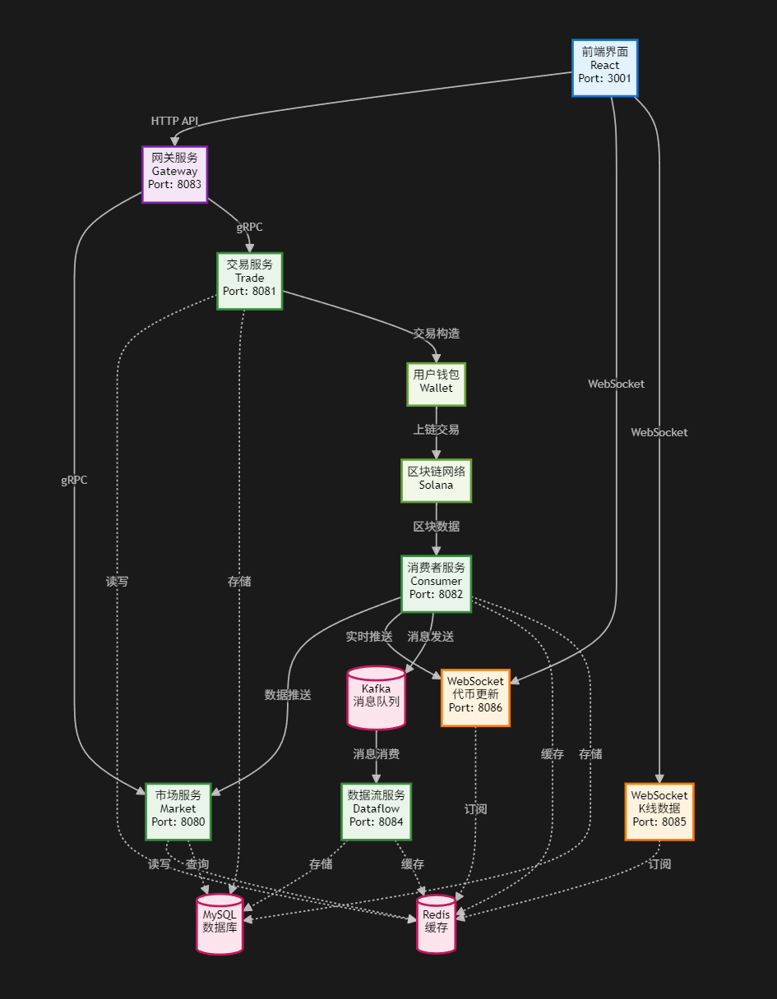

# Fun DEX

一个基于微服务架构的去中心化交易平台，支持实时代币交易和数据展示。

## 项目概述

Fun DEX 是一个完整的去中心化交易系统，采用微服务架构设计，包含前端交易界面和多个后端服务，支持实时链上数据解析、代币交易、WebSocket 实时通信等功能。

## 快速开始

### 环境准备

请确保您的系统已安装以下依赖：[参考版本]

强烈建议使用 ubuntu 系统来跑该项目，windows 会有各种问题：比如路径处理不同，导致文件找不到等等。

- Go 1.24.2
- Node.js 18.20.8
- npm 或 yarn
- Docker & Docker Compose (如果使用容器部署)

### 运行步骤

按照以下步骤启动完整的交易系统：

#### 1. 进入项目目录

```bash
cd fun_dex
```

#### 2. 安装后端依赖

```bash
go mod tidy
```

#### 3. 安装前端依赖

```bash
cd pump-tokens-ui
npm install
```

#### 4. 启动后端微服务

请按照以下顺序启动各个服务：

**启动消费者服务**

```bash
cd fun_dex/consumer
go run consumer.go
```

**启动市场数据服务**

```bash
cd fun_dex/market
go run market.go
```

**启动交易服务**

```bash
cd fun_dex/trade
go run trade.go
```

**启动网关服务**

```bash
cd fun_dex/gateway
go run gateway.go
```

**启动 WebSocket 服务**

```bash
cd fun_dex/websocket
go run token_websocket_server.go
```

#### 5. 启动前端应用

```bash
cd fun_dex/pump-tokens-ui
npm run build
npx serve -s build -l 3001
```

#### 6. 访问应用

打开浏览器访问 `http://localhost:3001` 开始使用交易界面。

### 注意

你的防火墙的相关端口要打开：每个服务运行在不同的端口，这个端口都要打开
并且要更换当前的 ip 地址为你自己的服务器 ip ，可以全局搜索 118.194.235.63 后进行替换

## 使用 Docker Compose 部署

项目提供了 Docker Compose 配置，可以快速部署所需的中间件服务（MySQL、Redis、Kafka）。

### 1. 使用自动化脚本（推荐）

项目提供了自动化脚本，可以一键启动 Docker 服务并导入数据：

```bash
# 进入 docker 目录
mkdir docker
cd docker

# 添加执行权限
chmod +x start-docker.sh import-sql.sh

# 启动 Docker 服务
./start-docker.sh

# 导入 SQL 脚本
./import-sql.sh
```

### 3. 验证服务状态

```bash
# 检查所有容器是否正常运行
docker compose ps

# 检查 MySQL 是否可以连接
docker exec -it mysql-db mysql -u root -p -e "SHOW DATABASES;"

# 检查 Redis 是否可以连接
docker exec -it redis-cache redis-cli ping
```

### 4. 停止服务

当不需要使用时，可以停止所有服务：

```bash
cd docker
docker compose down
```
### 5. 启动服务
```bash

# 启动服务
docker compose up -d
```


## 更新服务rpc接口
第一步：go install github.com/zeromicro/go-zero/tools/goctl@latest
第二部：goctl rpc protoc market.proto --go_out=./ --go-grpc_out=./ --zrpc_out=./
第三步：protoc market/market.proto --descriptor_set_out=gateway/internal/embed/pb/market.pb

## 微服务架构



系统采用微服务架构，各服务职责如下：

### Consumer 消费者服务

负责实时解析链上消息，是整个系统的数据入口。通过 Kafka、WebSocket、Redis、gRPC 等多种通信方式将解析后的数据分发给其他服务。

### Trade 交易服务

处理用户的交易下单操作，负责交易构造和执行。接收用户下单请求后，构造交易数据，返回交易哈希供钱包签名，最终将签名后的交易提交到区块链。

### Market 市场数据服务

提供交易界面所需的各种市场数据，包括代币地址、当前市值、价格信息等。前端页面显示的所有市场相关数据都来源于此服务。

### WebSocket 实时通信服务

提供实时数据推送功能，确保用户界面能够实时显示最新的代币信息和交易数据。支持实时推送新代币上线、价格变动等信息。

服务通过 Redis 发布/订阅机制接收和处理实时数据，支持环境变量配置 Redis 连接信息。

### Gateway 网关服务

作为系统的统一入口，所有 HTTP 请求都通过网关服务与各个微服务进行交互。负责请求路由、负载均衡和统一的接口管理。

### DataFlow 数据流服务

专门负责处理 Kafka 消息的消费服务。接收来自 Consumer 服务的实时交易数据，经过处理后存储到 MySQL 和 Redis 中，为后续的 K 线图展示和数据分析提供数据支持。

## 技术栈

- **后端**：Go, Kafka, Redis, MySQL, gRPC, WebSocket
- **前端**：React, JavaScript, HTML5, CSS3
- **通信**：HTTP REST API, WebSocket, gRPC
- **数据存储**：MySQL, Redis
- **消息队列**：Kafka
