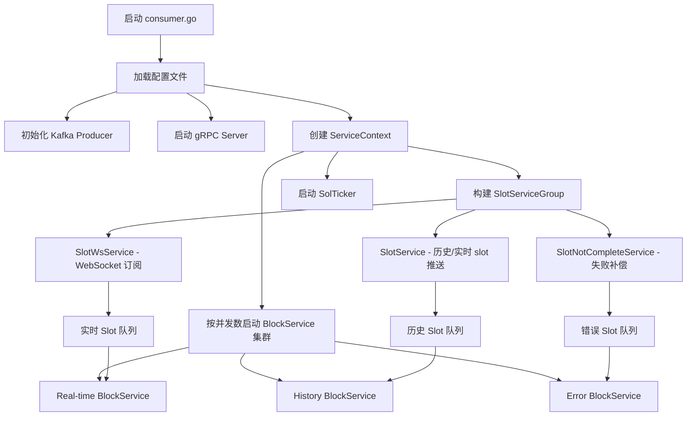
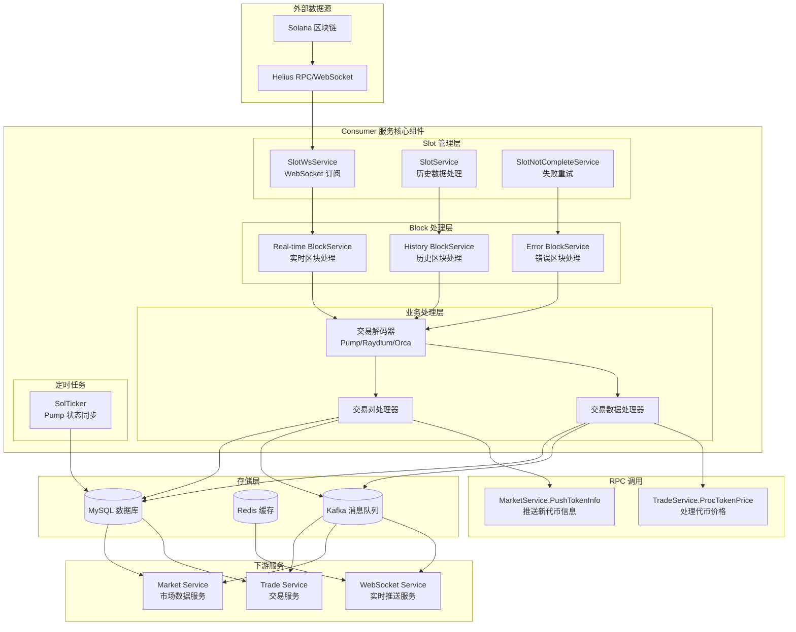

# Consumer 服务文档


## 一、前置基础知识

- **链上依赖**：Solana 主网，使用 Helius RPC/WS。需要了解 slot、block、transaction 的层级关系。
- **go-zero 服务形态**：遵循标准目录结构，框架基础在实战部分的课程快速过一下。
- **核心第三方组件**
  - `github.com/gorilla/websocket`：监听 slot。
  - `github.com/blocto/solana-go-sdk`：获取区块/解析交易。
  - `github.com/panjf2000/ants`：消费者内部协程池。
  - Kafka (sarama)：对外广播链上交易事件。
- **数据模型概念**
  - `solmodel.Block/Trade/Token/...`：MySQL ORM。
    PS：想快速熟悉一个项目，先分析库表结构设计
  - 交易分表命名：`trade_YYYY_MM_DD`。
- **solana公链基础**
  -账户模型，交易结构等等      
- **golang并发基础**
  -理解goroutine，channel，map等基础语法
---

## 二、consumer服务整体架构流程

### 2.1 组件视图

- **SlotServiceGroup（生产者）**
  - `SlotService`：存量，增量 slot 扫描、双向通道写入。
  - `SlotNotCompleteService`：监控数据库中的失败区块并补偿。
- **BlockService（消费者）**
  - 根据配置的 `Consumer.Concurrency` 创建多实例，竞争消费 slot 通道。
  -增量，存量，失败处理，历史恢复，处理区块的逻辑是一致的
  - 内部持有 ants worker pool，用于并行解析交易和存储。
- **SolTicker**
  - 每分钟扫描 PumpFun 代币迁移状态，更新 Pair 表与 Pump AMM 数据。
- **gRPC Server**
  - 无RPC接口对外暴露。

### 2.2 启动与运行流程



### 2.3 数据流向全景图



---

## 三、核心业务流程

Consumer服务的核心业务逻辑分为三个主要模块：**Slot生产者**、**Block消费者**和**定时任务**。

### 3.1 Slot生产者模块

Slot生产者负责获取slot数据，并分发给Block消费者处理。

#### 3.1.1 SlotServiceGroup架构
```
SlotServiceGroup
├── SlotService          # 存量，增量数据处理
└── SlotNotCompleteService # 失败补偿机制
```

#### 3.1.2 WebSocket连接管理 (SlotWsService)
1. **连接建立**：
   - `MustConnect()` 无限重试连接到 Helius WebSocket
   - 连接成功后发送 `slotSubscribe` 订阅消息
   - 支持断线重连，检测 `close` 和 `broken pipe` 错误

2. **消息处理**：
   - `ReadSlotMessage()` 持续读取WebSocket消息
   - 解析JSON格式的SlotResp，提取slot号
   - 将实时slot推送到 `realtimeCh` 队列

#### 3.1.3 slot数据处理 (SlotService)
1. **起始点确定**：
   - `setStartSlot()`：从配置 `StartBlock` 开始
   - 查询数据库最后成功的区块，回退100个slot作为安全冗余
   - 避免遗漏处理的区块

2. **终止点确定**：
   - `setEndSlot()`：监听WebSocket第一个实时slot作为历史数据终点
   - 确保历史数据和实时数据的无缝衔接

3. **历史数据推送**：
   - `consumeHistoricalSlots()` 按顺序推送历史slot
   - 每个slot间隔5ms，控制推送速度
   - 完成后发送 `historicalDone` 信号，切换到增量模式，不断监听websocket数据

#### 3.1.4 失败重试机制 (SlotNotCompleteService)
1. **监控机制**：
   - 每5秒扫描数据库中状态为 `BlockFailed` 的区块
   - 增加一点冗余量

2. **重试策略**：
   - 将超时slot推送到 `errorCh` 错误队列
   - 每秒最推送1个，避免队列堆积
   - 专门的错误处理BlockService处理这些slot

#### 3.1.5 队列分发机制
```
SlotService 管理三个队列：
├── realtimeCh   # 实时slot队列 (容量50)
├── historicalCh # 历史slot队列 (容量50)  
└── errorCh      # 错误重试队列 (容量1)
```

### 3.2 Block消费者模块

Block消费者从slot队列中获取slot号，处理对应的区块数据。

#### 3.2.1 BlockService配置
```
BlockService集群 (按配置并发数启动)
├── Real-time BlockService  # 处理实时队列
├── History BlockService    # 处理历史队列
└── Error BlockService      # 处理错误队列 (10个实例)
```

#### 3.2.2 区块处理流程 (ProcessBlock)
1. **幂等性检查**：
   - `FindOneBySlot()` 检查区块是否已处理
   - 状态为 `processed/skipped` 则直接跳过

2. **区块数据获取**：
   - `GetSolBlockInfoDelay()` 从Helius RPC获取完整区块信息
   - 包含所有交易、账户状态、日志消息等
   - 处理 `was skipped` 的空区块

3. **SOL价格计算**：
   - `GetBlockSolPrice()` 遍历区块中的所有交易
   - 识别稳定币DEX交易（Orca、Raydium CLMM、Meteora、Phoenix）
   - 根据 SOL ↔ USDC/USDT 交易计算价格，去除极值后求平均值

#### 3.2.3 交易解码引擎 (DecodeTx)

交易解码引擎是Consumer服务的核心组件，负责解析Solana区块中的所有交易，识别DEX相关的交易并提取关键信息。

##### 3.2.3.1 解码前置处理
1. **交易有效性检查**：
   ```go
   // 检查交易执行状态
   if tx.Meta.Err != nil {
       return // 跳过执行失败的交易
   }
   
   // 过滤投票交易
   if len(tx.Meta.LogMessages) == 0 {
       return nil, fmt.Errorf("decode tx maybe vote tx")
   }
   ```

2. **数据结构初始化**：
   ```go
   type DecodedTx struct {
       BlockDb             *solmodel.Block                    // 区块信息
       SolPrice            float64                           // SOL价格
       TokenAccountMap     map[string]*TokenAccount          // 代币账户映射
       InnerInstructionMap map[int]*client.InnerInstruction  // 内部指令映射
       Tx                  *client.BlockTransaction          // 原始交易
       TxIndex             int                               // 交易索引
       TxHash              string                            // 交易哈希
       PumpEvents          []PumpEvent                       // Pump事件列表
   }
   ```

3. **TokenAccount映射构建**：
   - 解析 `PreTokenBalances` 和 `PostTokenBalances`
   - 构建代币账户余额变化映射
   - 识别新创建和关闭的代币账户
   - 提取代币精度、所有者等元数据

##### 3.2.3.2 支持的DEX协议与解码器

1. **PumpFun协议** (`ProgramStrPumpFun`)：
   - **指令类型**：
     ```go
     PumpInstructionBuy    = 0xeaebda01123d0666  // 买入交易
     PumpInstructionSell   = 0xad837f01a485e633  // 卖出交易  
     PumpInstructionCreate = 0x77071c0528c81e18  // 创建代币
     PumpInstructionSync   = 0x1d9acb512ea545e4  // 状态同步
     ```
   - **解码逻辑**：解析指令数据获取交易参数，从日志消息中提取PumpEvent事件
   - **特殊处理**：支持代币创建交易的完整信息提取

2. **PumpAmm协议** (`ProgramStrPumpAmm`)：
   - **解码器**：`PumpAmmDecoder`
   - **支持指令**：Buy、Sell、CreatePool
   - **Borsh解码**：使用Borsh反序列化指令数据
   - **事件解析**：从交易日志中解析买卖事件和池子状态

3. **Raydium V4** (`ProgramStrRaydiumV4`)：
   - **指令识别**：
     ```go
     switch instruction.Data[0] {
     case 9, 11: // Swap指令
     case 1:     // Add Liquidity指令
     }
     ```
   - **内部指令处理**：解析Token转账的内部指令
   - **账户映射**：支持V1(17个账户)和V2(18个账户)版本

4. **Raydium CPMM** (`cpmm.ProgramRaydiumCPMMProgram`)：
   - **解码器**：`CPMMDecoder`
   - **恒定乘积**：处理恒定乘积做市商交易
   - **流动性计算**：提取池子储备量和价格信息

5. **Raydium CLMM** (`clmm.ProgramRaydiumCLMMProgram`)：
   - **解码器**：`CLMMDecoder`
   - **集中流动性**：处理集中流动性做市商交易
   - **价格区间**：支持价格区间和流动性位置管理

6. **Token Program** (`common.TokenProgramID`)：
   - **SPL代币**：处理标准SPL代币转账
   - **指令类型**：Transfer、InitializeAccount等
   - **账户初始化**：识别新代币账户的创建

7. **Token2022** (`common.Token2022ProgramID`)：
   - **解码器**：`Token2022Decoder`
   - **新标准**：支持Token2022扩展功能
   - **向后兼容**：兼容传统Token Program功能

##### 3.2.3.3 解码流程详解

1. **主指令解码**：
   ```go
   // 遍历所有主指令
   for i := range tx.Transaction.Message.Instructions {
       instruction := &tx.Transaction.Message.Instructions[i]
       program := tx.AccountKeys[instruction.ProgramIDIndex].String()
       
       // 根据ProgramID路由到对应解码器
       trade, err = DecodeInstruction(ctx, sc, dtx, instruction, i)
   }
   ```

2. **内部指令处理**：
   - 解析CPI（Cross Program Invocation）调用
   - 处理复合交易中的嵌套指令
   - 支持Jupiter等聚合器的复杂路由

3. **错误处理策略**：
   ```go
   // 只记录已知错误类型，忽略未知指令
   if err != nil && !errors.Is(err, ErrTokenAmountIsZero) && 
      !errors.Is(err, ErrNotSupportWarp) && 
      !errors.Is(err, ErrNotSupportInstruction) && 
      !errors.Is(err, ErrUnknownProgram) {
       logx.Error(err)
   }
   ```

##### 3.2.3.4 交易信息提取与验证

1. **基础信息提取**：
   - 交易哈希：`base58.Encode(tx.Transaction.Signatures[0])`
   - 账户映射：从`AccountKeys`中解析参与账户
   - 代币余额：对比Pre/Post TokenBalances获取变化量

2. **价格计算**：
   - 基于代币储备量计算实时价格
   - 使用SOL价格转换为USD价格
   - 计算市值(Mcap)和完全稀释估值(FDV)

3. **交易对信息构建**：
   ```go
   type Pair struct {
       ChainId          string  // 链ID
       Addr             string  // 交易对地址
       BaseTokenAddr    string  // 基础代币地址
       BaseTokenDecimal uint8   // 基础代币精度
       TokenAddr        string  // 目标代币地址
       TokenDecimal     uint8   // 目标代币精度
       BlockTime        int64   // 区块时间
       BlockNum         int64   // 区块号
   }
   ```

##### 3.2.3.5 性能优化与容错

1. **解码器复用**：每种协议使用专门的解码器结构体，避免重复初始化
2. **错误分类**：区分已知错误和未知错误，减少无效日志
3. **内存管理**：合理使用切片预分配，减少内存重新分配
4. **并发安全**：解码过程无共享状态，支持并发处理

##### 3.2.3.6 扩展性设计

1. **插件化架构**：新增DEX协议只需实现对应解码器接口
2. **版本兼容**：支持同一协议的多个版本（如Raydium V1/V2）
3. **配置驱动**：通过常量配置支持的Program地址
4. **事件驱动**：基于日志消息解析，适应协议升级

#### 3.2.4 数据存储与分发 (并行处理)
1. **交易数据存储**：
   - `SaveTrades()` 按交易对分组，过滤无效记录
   - `BatchSaveByTrade()` 批量写入分表，支持死锁重试
   - 按天动态建表，提高查询性能

2. **池子信息同步**：
   - `SaveToken()` 保存代币基础信息
   - `SavePair()` 保存交易对信息  
   - `SavePoolInfo()` 同步Raydium/Pump池子状态

3. **消息队列推送**：
   - `SendTx()` 将有效交易推送到Kafka
   - Topic来自配置 `KqSolTrades.Topic`
   - 下游服务消费交易数据进行进一步处理

4. **RPC服务调用**：
   - **MarketService.PushTokenInfo**: 发现新PumpFun代币时调用
   - **TradeService.ProcTokenPrice**: 每笔交易完成后更新价格

#### 3.2.5 容错与监控
1. **协程池管理**：使用ants协程池控制并发数，避免goroutine暴涨
2. **错误处理**：区块处理失败会标记状态，由失败重试机制处理
3. **性能监控**：记录处理时间、队列大小等关键指标

### 3.3 定时任务模块

#### 3.3.1 SolTicker - PumpFun迁移监控
1. **执行周期**：每分钟执行一次 `startSyncPumpPoint()`

2. **迁移检测逻辑**：
   - 查询 `Pair.PumpPoint=0` 的记录（未迁移状态）
   - 检查是否存在对应的 PumpSwap 交易对
   - 验证代币是否已从PumpFun迁移到Raydium

3. **状态更新**：
   ```go
   // 发现迁移后更新状态
   pair.PumpPoint = 1                    // 标记已迁移
   pair.PumpStatus = PumpStatusMigrating // 更新迁移状态
   
   // 修正初始流动性数据
   PumpSwapPair.InitTokenAmount = Pump2RaydiumInitTokenAmount
   PumpSwapPair.InitBaseTokenAmount = Pump2RaydiumInitBaseTokenAmount
   ```

4. **数据修正**：
   - 根据PumpFun到Raydium的固定迁移规则
   - 修正初始代币数量和基础代币数量
   - 确保价格计算的准确性

---

### 3.4 模块间协作流程

#### 3.4.1 数据流转链路
```
Solana区块链 → SlotWsService → 队列分发 → BlockServices → 数据存储/推送 → 下游服务
```

#### 3.4.2 协作时序
1. **Slot生产者启动**：
   - SlotWsService建立WebSocket连接
   - 确定历史数据起止点
   - 开始推送历史slot到historicalCh

2. **Block消费者启动**：
   - 多个BlockService实例竞争消费队列
   - 历史数据优先处理，确保数据完整性
   - 实时数据并行处理，保证低延迟

3. **定时任务运行**：
   - SolTicker独立运行，监控PumpFun迁移
   - 与主流程解耦，不影响实时数据处理

---

## 四、核心要点思考

### 4.1 如何保证系统的可靠性与容错？

**Q1: 如何避免数据丢失和重复处理？**
- **双通道设计**：为什么要设计历史、实时、错误三类通道？如何确保它们互不阻塞？
- **幂等机制**：区块状态（processed/skipped/failed）如何保证只处理一次？重复slot如何识别？

**Q2: 当外部依赖失败时如何处理？**
- **失败兜底**：Helius RPC请求失败时，为什么要插入`failed`状态的block记录？
- **补救机制**：`resume`服务如何工作？什么时候触发补救流程？

**Q3: 网络连接不稳定时如何保证服务连续性？**
- **WS重连策略**：WebSocket连接异常（close/broken pipe）时的重连逻辑是什么？
- **订阅恢复**：重连后如何确保不丢失slot数据？

### 4.2 如何优化性能与支持扩展？

**Q4: 如何应对不同的负载压力？**
- **并发控制**：`Consumer.Concurrency`参数如何设置？不同环境下的最佳实践是什么？
- **资源管理**：为什么使用ants协程池？如何避免goroutine暴涨导致的内存问题？

**Q5: 大数据量场景下如何保证写入性能？**
- **分表策略**：为什么按天动态建表？如何处理跨天的数据一致性？
- **批量操作**：批量插入的最佳batch size是多少？如何处理死锁和重试？

**Q6: 系统如何支持水平扩展？**
- **无状态设计**：BlockService实例之间如何避免状态冲突？
- **负载均衡**：多个Consumer实例如何协同工作？

### 4.3 如何确保数据一致性？

**Q7: 复杂的数据处理链路如何保证一致性？**
- **状态链管理**：Slot → Block → Trade 的状态转换如何追踪？失败时如何回滚？
- **异常处理**：任何环节失败时，如何在数据库和日志中留下完整的痕迹？

**Q8: 如何防止数据遗漏？**
- **完整性检查**：`SlotNotCompleteService`如何确保不会漏处理slot？
- **监控机制**：如何及时发现和处理遗漏的数据？

**Q9: 并发场景下如何避免数据竞态？**
- **单一职责**：为什么Token、Pair、Pool更新都由同一个BlockService负责？
- **锁机制**：在什么场景下需要使用锁？如何避免死锁？

### 4.4 外部系统集成有哪些考虑？

**Q10: 如何设计高效的消息传递机制？**
- **Kafka使用**：为什么选择Kafka广播交易事件？topic设计原则是什么？
- **消息格式**：下游服务如何高效消费这些事件？

**Q11: 数据存储架构如何支持不同的查询需求？**
- **MySQL设计**：表结构如何支持高频查询和分析需求？索引策略是什么？
- **Redis缓存**：哪些数据适合放在Redis？缓存更新策略如何设计？

**Q12: 服务间通信如何保证效率和可靠性？**
- **gRPC选择**：为什么只暴露Ping接口？什么场景下需要扩展RPC接口？
- **内嵌逻辑**：采用内嵌逻辑运行的优缺点是什么？
