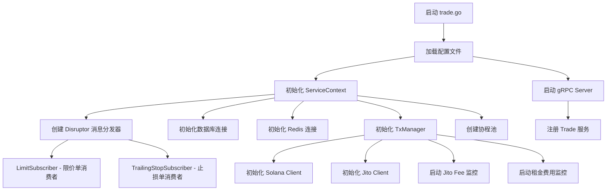
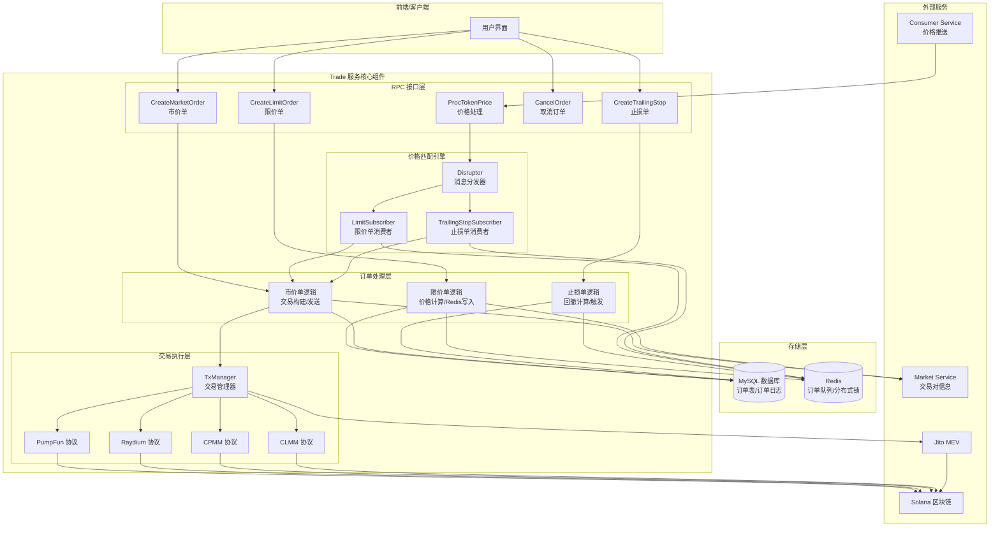

# Trade 服务文档

## 一、前置基础知识

- **服务定位**：Trade服务是DEX交易的核心服务，负责订单管理、交易执行、价格匹配等功能
- **go-zero 服务形态**：标准RPC服务，通过gRPC对外提供接口
- **核心第三方组件**
  - `Disruptor`：高性能无锁并发框架，用于价格消息分发
  - `Redis`：订单队列管理与分布式锁
- **数据模型概念**
  - `trademodel.TradeOrder`：订单表（包含所有订单类型）
  - `trademodel.TradeOrderLog`：订单日志表（记录状态变更）
  - Redis订单队列：限价单和止损单存储
- **Solana 交易基础**
  - 理解指令(Instruction)、交易(Transaction)、签名机制
  - 了解 ATA(Associated Token Account)、Token Program、System Program
  - 掌握 Raydium、PumpFun 等 DEX 协议
- **业务基础知识**
  - 市价单（Market Order）：立即按当前市场价成交
  - 限价单（Limit Order）：指定价格挂单，价格触达时成交
  - 止损单（Trailing Stop）：移动止损，跟随最高价回撤触发
  - 翻倍出本（Double Out）：买入后自动卖出一半回本

---

## 二、Trade服务整体架构流程

### 2.1 组件视图

- **RPC 服务层（gRPC Server）**
  - 对外提供 11 个核心接口（见proto定义）PS：目前只实现了核心接口
  - 负责参数校验和业务逻辑调用
  
- **订单管理模块（Order Management）**
  - `CreateLimitOrderLogic`：限价单创建
  - `CreateMarketOrderLogic`：市价单创建
  - `CreateTrailingStopLogic`：止损单创建
  - `CancelOrderLogic`：订单取消
  
- **价格监听模块（Price Listener）**
  - `ProcTokenPriceLogic`：接收Consumer服务推送的价格
  - `DisruptorWrapper`：Disruptor消息分发器
  - `LimitSubscriber`：限价单价格匹配消费者
  - `TrailingStopSubscriber`：止损单价格匹配消费者
  
- **交易执行模块（Transaction Executor）**
  - `TxManager`：交易管理器，负责构建和发送交易
  - 支持 PumpFun、Raydium V4、CPMM、CLMM 等多种DEX协议
  - 支持Jito反MEV
  
- **订单查询模块（Order Query）**
  - `QueryCurrentOrdersLogic`：查询当前订单
  - `QueryOrderHistoryLogic`：查询历史订单
  - `QueryHoldTokenLogic`：查询持仓信息

### 2.2 启动与运行流程



### 2.3 数据流向全景图



---

## 三、核心业务流程

Trade服务的核心业务逻辑分为四个主要模块：**市价单**、**限价单**、**止损单**和**辅助功能**。

### 3.1 市价单模块（Market Order）

市价单是最基础的交易类型，按当前市场价格立即成交。

#### 3.1.1 业务流程概述

```
用户提交订单 → 参数校验 → 获取交易对信息 → 计算价格 → 创建订单入库 
→ 构建交易参数 → 构建交易指令 → 获取区块哈希 → 构建未签名交易 
→ 签名机签名 → 发送上链 → 更新订单状态 → 返回结果
```

#### 3.1.2 接口定义（CreateMarketOrder）

**请求参数**：
```protobuf
message CreateMarketOrderRequest {
  int32 chain_id = 1;                   // 链ID（Solana: 100000）
  string token_ca = 2;                  // Token合约地址
  SwapType swap_type = 3;               // 交易类型（Buy=1/Sell=2）
  string amount_in = 4;                 // 输入数量（Buy:SOL数量，Sell:Token数量）
  bool double_out = 5;                  // 是否翻倍出本
  bool is_one_click = 6;                // 是否一键交易
  string user_wallet_address = 7;       // 用户钱包地址
}
```

**返回结果**：
```protobuf
message CreateMarketOrderResponse {
  string tx_hash = 1;                   // 未签名交易（Base64）或交易哈希
}
```

#### 3.1.3 核心逻辑详解

##### 1. 参数校验与数据准备

```go
// 1. 校验交易数量
amountDecimal, err := decimal.NewFromString(in.AmountIn)
if !amountDecimal.IsPositive() {
    return nil, xcode.AmountErr
}

// 2. 调用Market服务获取交易对信息
pairInfo, err := l.svcCtx.MarketClient.GetPairInfoByToken(l.ctx, &market.GetPairInfoByTokenRequest{
    ChainId:      int64(in.ChainId),
    TokenAddress: in.TokenCa,
})

// 3. 检查交易对有效性
if pairInfo.Fdv == 0 {
    return nil, fmt.Errorf("pair fdv is 0")
}
```

**关键数据说明**：
- `BaseTokenPrice`: SOL 对 USD 的价格
- `TokenPrice`: Token 对 USD 的价格
- `Fdv`: 完全稀释市值（Fully Diluted Valuation）

##### 2. 价格计算逻辑

```go
// 计算 Token/Base 价格（Token 对 SOL 的价格）
baseTokenPrice := decimal.NewFromFloat(pairInfo.BaseTokenPrice)     // SOL/USD
tokenPriceUsd := decimal.NewFromFloat(pairInfo.TokenPrice)          // Token/USD
tokenPriceDecimal := tokenPriceUsd.Div(baseTokenPrice)              // Token/SOL

// 计算订单价值（SOL本位）
orderValueBase := amountDecimal                                      // 买单：输入SOL数量
if in.SwapType == trade.SwapType_Sell {
    orderValueBase = amountDecimal.Mul(tokenPriceDecimal)           // 卖单：Token数量 × Token价格
}
```

**价格计算公式**：
```
Token/SOL 价格 = Token/USD 价格 ÷ SOL/USD 价格

示例：
- SOL价格 = $50
- Token价格 = $1
- Token/SOL = 1 ÷ 50 = 0.02 SOL

买单：1 SOL → 预期得到 50 Token
卖单：100 Token → 预期得到 2 SOL
```

##### 3. 创建订单记录

```go
order := &trademodel.TradeOrder{
    TradeType:      int64(trade.TradeType_Market),  // 市价单类型
    ChainId:        int64(in.ChainId),
    TokenCa:        in.TokenCa,
    SwapType:       int64(in.SwapType),
    Status:         int64(trade.OrderStatus_Proc),  // 处理中状态
    OrderCap:       capDecimal,                     // 市值
    OrderAmount:    amountDecimal,                  // 数量
    OrderPriceBase: tokenPriceDecimal,              // Token/SOL价格
    OrderValueBase: orderValueBase,                 // SOL本位价值
    OrderBasePrice: baseTokenPrice,                 // SOL/USD价格
    DoubleOut:      util.BoolToInt64(in.DoubleOut),
    DexName:        pairInfo.Name,                  // DEX名称
    PairCa:         pairInfo.Address,               // 交易对地址
    WalletAddress:  in.UserWalletAddress,
}

// 插入订单和日志记录
err = model.InsertWithLog(l.ctx, order)
```

#### 3.1.4 交易构建流程

##### 1. 判断交易方向

```go
// 默认为买单（输入SOL，输出Token）
inTokenAddr := pairInfo.BaseTokenAddress   // SOL
outTokenAddr := pairInfo.TokenAddress      // MemeToken
inDecimal := uint8(pairInfo.BaseTokenDecimal)    // 9
outDecimal := uint8(pairInfo.TokenDecimal)       // 6或9

// 获取Token程序类型（Token Program或Token2022）
inTokenProgram := aSDK.TokenProgramID.String()
outTokenProgram := aSDK.TokenProgramID.String()
if tokenInfo.Program != "" {
    outTokenProgram = tokenInfo.Program    // Token2022
}

// 卖单需要交换输入输出
if order.SwapType == int64(trade.SwapType_Sell) {
    inTokenAddr, outTokenAddr = outTokenAddr, inTokenAddr
    inDecimal, outDecimal = outDecimal, inDecimal
    inTokenProgram, outTokenProgram = outTokenProgram, inTokenProgram
}
```

##### 2. 构建交易参数

```go
param := &trade.CreateMarketTx{
    UserWalletAddress: order.WalletAddress,  // 用户钱包地址
    AmountIn:          order.OrderAmount.String(),
    IsAntiMev:         order.IsAntiMev != 0,      // 是否反MEV
    IsAutoSlippage:    order.IsAutoSlippage != 0,  // 是否自动滑点
    Slippage:          uint32(order.Slippage),     // 滑点（基点）
    GasType:           int32(order.GasType),       // Gas类型
    TradePoolName:     pairInfo.Name,              // DEX协议名称
    InDecimal:         inDecimal,
    OutDecimal:        outDecimal,
    InTokenCa:         inTokenAddr,
    OutTokenCa:        outTokenAddr,
    PairAddr:          pairInfo.Address,
    Price:             order.OrderPriceBase.String(),
    UsePriceLimit:     usePriceLimit,              // 是否启用价格限制
    InTokenProgram:    inTokenProgram,
    OutTokenProgram:   outTokenProgram,
}
```

##### 3. 自动滑点重试机制

```go
tryTimes := 0
// 如果开启自动滑点，且遇到滑点错误，则增大滑点重试
for tryTimes == 0 || (param.IsAutoSlippage && errors.Is(err, xcode.SlippageLimit) && tryTimes < 3) {
    tryTimes++
    switch tryTimes {
    case 1:
        param.Slippage = 1000  // 1% (初始滑点)
    case 2:
        param.Slippage = 4500  // 4.5%
    case 3:
        param.Slippage = 7000  // 7%
    }
    txHash, err = l.createAndSendTx(param)
}
```

**滑点说明**：
- 滑点以基点（Basis Point）表示，1% = 100基点
- 初始滑点1%，失败后逐步提高到4.5%和7%
- 最多重试3次

#### 3.1.5 交易指令构建（以PumpFun为例）

##### 1. 费用计算

```go
// 需要创建1个ATA账户的租金
lamportCost := tm.rentFee  // 约 2,039,280 lamports

// 判断交易方向
swapDirection := sol.Swap_Direction_Buy
tokenMint := in.OutMint
if in.OutMint == ag_solanago.WrappedSol {
    swapDirection = sol.Swap_Direction_Sell
    tokenMint = in.InMint
}

// 转换输入金额
amtDecimal, _ := decimal.NewFromString(in.AmountIn)
amtDecimal = amtDecimal.Mul(decimal.NewFromInt(sol.Decimals2Value[in.InDecimal]))
amountUint64 := uint64(amtDecimal.IntPart())  // 转换为最小单位
```

##### 2. 设置计算单元预算与优先费

```go
// 创建Gas费用和Jito Tip指令
instructions, lamportCostFee, err := tm.CreateGasAndJitoByGasFee(
    ctx,
    in.IsAntiMev,          // 是否反MEV
    initiator,              // 用户钱包
    sol.PumpFunSwapCU,      // 计算单元限制（150,000）
    sol.GasMODE[1],         // Gas费用
)
lamportCost += lamportCostFee
```

**CreateGasAndJitoByGasFee 内部逻辑**：

```go
// 1. 获取Jito小费（用于反MEV）
tipFee := tm.ListJitoFloorFee()  // 获取50th百分位数，如 0.00001 SOL
if tipFee <= 0 || tipFee >= sol.JitoMaxFee {
    return nil, 0, xcode.AntiErr
}
jitoFeeInLamport := ConverFloat642Uint64(tipFee, sol.SolDecimal)  // 转换为lamports

// 2. 计算优先费价格（microlamports per CU）
gasPriceMicroLamports = (gasFeeInLamport - sol.GasPerSignature) * 1e6 / uint64(cuLimit)

// 示例：
// gasFeeInLamport = 150,000
// sol.GasPerSignature = 5,000
// cuLimit = 150,000
// gasPriceMicroLamports = (150,000 - 5,000) * 1,000,000 / 150,000 = 966,666

// 3. 构建指令
instructions := []ag_solanago.Instruction{
    computebudget.NewSetComputeUnitPriceInstruction(gasPriceMicroLamports),  // 设置CU价格
    computebudget.NewSetComputeUnitLimitInstruction(cuLimit),                 // 设置CU限制
}

// 4. 如果反MEV，添加Jito Tip指令
if isAntiMev {
    instructions = append(instructions,
        system.NewTransferInstruction(jitoFeeInLamport, initiator, TipAddress))
}

// 5. 返回总费用
feeInLamport := jitoFeeInLamport + gasFeeInLamport
return instructions, feeInLamport, nil
```

**费用组成说明**：
```
lamportCost（客户端余额校验用） = rentFee（ATA租金）
                                + lamportCostFee（Gas + Jito Tip）
                                + serviceFee（服务费 1%）
                                + amountUint64（实际购买金额，仅买单）

示例（买单）：
- rentFee: 2,039,280 lamports
- Gas Fee: 150,000 lamports
- Jito Tip: 10,000 lamports
- 服务费: 购买金额的 1%
- 购买金额: 1 SOL = 1,000,000,000 lamports
- 总计: 2,039,280 + 150,000 + 10,000 + 10,000,000 + 1,000,000,000 = 1,012,199,280 lamports
```

##### 3. 创建ATA账户

```go
// 创建用户的Token ATA账户（用于接收Token）
instructionNew, err := sol.CreateAtaIdempotent(initiator, initiator, tokenMint, ag_solanago.TokenProgramID)
instructions = append(instructions, instructionNew)
```

##### 4. 余额检查与服务费计算

```go
// 获取钱包SOL余额
solBalanceInfo, err := tm.Client.GetBalance(ctx, initiator, ag_rpc.CommitmentFinalized)
solBalance := solBalanceInfo.Value

serviceFee := uint64(0)
if swapDirection == sol.Swap_Direction_Buy {
    // 买单：检查余额是否足够
    if solBalance < uint64(amtDecimal.IntPart()) {
        return nil, xcode.SolBalanceNotEnough
    }
    
    // 计算服务费（购买金额的1%）
    serviceFee = uint64(amtDecimal.Mul(sol.ServericeFeePercent).IntPart())
    lamportCost += serviceFee + amountUint64
}

// 检查总费用是否超出余额
if lamportCost > solBalance {
    return nil, xcode.SolGasNotEnough
}
```

##### 5. 构建交易指令

```go
if swapDirection == sol.Swap_Direction_Buy {
    // 买入交易
    buyInstruction, err := pumpfun.BuildBuyInstruction(
        initiator,                      // 用户钱包
        tokenMint,                      // Token地址
        amountUint64,                   // 购买金额（lamports）
        in.Slippage,                    // 滑点
        tm.Client,                      // RPC客户端
        priceDecimal.InexactFloat64(),  // 当前价格
        in.InDecimal,                   // 输入精度
        in.OutDecimal,                  // 输出精度
    )
    instructions = append(instructions, buyInstruction)
    
} else {
    // 卖出交易
    tokenAta, _, _ := ag_solanago.FindAssociatedTokenAddress(initiator, tokenMint)
    
    sellInstruction, solVolume, err := pumpfun.BuildSellInstruction(
        tokenAta,                       // Token账户
        initiator,                      // 用户钱包
        tokenMint,                      // Token地址
        amountUint64,                   // 卖出数量
        in.Slippage,                    // 滑点
        false,                          // 是否全部卖出
        tm.Client,                      // RPC客户端
        priceDecimal.InexactFloat64(),  // 当前价格
        in.InDecimal,                   // 输入精度
        in.OutDecimal,                  // 输出精度
    )
    instructions = append(instructions, sellInstruction)
    
    // 计算卖出服务费
    out := decimal.NewFromUint64(solVolume)
    serviceFee = uint64(out.Mul(sol.ServericeFeePercent).IntPart())
}
```

#### 3.1.6 构建未签名交易

```go
// 1. 获取最新区块哈希
resp, err := tm.Client.GetLatestBlockhash(ctx, ag_rpc.CommitmentFinalized)

// 2. 创建费用支付者
feePayer, err := aSDK.PublicKeyFromBase58(createMarketTx.UserWalletAddress)

// 3. 创建交易对象
tx, err := aSDK.NewTransaction(
    instructions,                              // 指令列表
    resp.Value.Blockhash,                      // 最新区块哈希
    aSDK.TransactionPayer(feePayer),           // 费用支付者
)

// 4. 初始化空签名
numSigners := int(tx.Message.Header.NumRequiredSignatures)
tx.Signatures = make([]aSDK.Signature, numSigners)

// 5. 序列化并Base64编码
txData, err := tx.MarshalBinary()
txBase64 := base64.StdEncoding.EncodeToString(txData)

return txBase64, nil
```

**未签名交易结构**：
```
Base64编码的交易（约300字节）
│
├─ 签名部分（空）: 64 bytes
│  └─ [0, 0, 0, ..., 0]
│
├─ Message部分
│  ├─ 区块哈希: 32 bytes
│  ├─ 账户列表: [...]
│  └─ 指令列表
│     ├─ #1 SetComputeUnitPrice
│     ├─ #2 SetComputeUnitLimit
│     ├─ #3 Transfer (Jito Tip, if AntiMEV)
│     ├─ #4 CreateATA
│     ├─ #5 Transfer (买入时，SOL → wSOL ATA)
│     ├─ #6 SyncNative (买入时)
│     └─ #7 Swap (PumpFun Buy/Sell)
│
└─ Base64编码: "AgIDEAQ..."
```

#### 3.1.7 订单状态管理

```go
// 1. 初始状态：Proc（处理中）
order.Status = int64(trade.OrderStatus_Proc)

// 2. 发送成功：OnChain（已上链，待确认）
if err == nil && len(txHash) < 100 {  // 正常交易哈希长度
    order.Status = int64(trade.OrderStatus_OnChain)
    order.TxHash = txHash
    model.UpdateOrderBySelect(ctx, order, "status", "tx_hash")
}

// 3. 发送失败：Fail（失败）
if err != nil {
    order.Status = int64(trade.OrderStatus_Fail)
    order.FailReason = err.Error()
    model.UpdateOrderBySelect(ctx, order, "status", "fail_reason")
}
```

**订单状态流转**：
```
Waiting（等待）  ← 限价单/止损单初始状态
    ↓
Proc（处理中）   ← 市价单初始状态，限价单/止损单触发后
    ↓
OnChain（已上链）← 交易发送成功，待区块确认
    ↓
Suc（成功）      ← 交易确认成功（由定时任务更新）
    ↓
Fail（失败）     ← 交易失败
Cancel（取消）   ← 用户取消
FailTimeout（超时失败）
```

---

### 3.2 限价单模块（Limit Order）

限价单允许用户设置目标价格，当市场价格达到目标价时自动触发交易。

#### 3.2.1 业务流程概述

```
用户创建限价单 → 计算目标价格 → 订单入库（Waiting状态） → 写入Redis队列
    ↓
Consumer服务推送价格 → Disruptor分发 → LimitSubscriber消费
    ↓
从Redis读取订单 → 价格匹配判断 → 触发订单（更新为Proc状态）
    ↓
删除Redis键 → 更新未触发订单 → 调用市价单接口执行
```

#### 3.2.2 接口定义（CreateLimitOrder）

**请求参数**：
```protobuf
message CreateLimitOrderRequest {
  int64 chain_id = 1;
  string token_ca = 2;
  SwapType swap_type = 3;           // Buy/Sell
  string amount = 4;                // 数量（Buy:SOL，Sell:Token）
  string price_usd = 5;             // 目标价格（USD）
  bool double_out = 6;              // 是否翻倍出本
  string token_cap = 7;             // 目标市值（按市值挂单）
}
```

**两种挂单模式**：
1. **按价格挂单**：`price_usd` 不为空，`token_cap` 为空
2. **按市值挂单**：`token_cap` 不为空，自动计算目标价格

#### 3.2.3 价格计算逻辑

##### 模式A：按价格挂单

```go
// 前端传入的USD价格
priceUsdDecimal, _ := decimal.NewFromString(in.PriceUsd)

// 转换为Token对Base（SOL）价格
//   Token/Base = Token/USD ÷ Base/USD
priceBaseDecimal := priceUsdDecimal.Div(decimal.NewFromFloat(pairInfo.BaseTokenPrice))

// 计算订单价值（SOL本位）
if in.SwapType == trade.SwapType_Buy {
    // 买单：输入SOL数量，即订单总价
    order.OrderValueBase = amountDecimal
} else if in.SwapType == trade.SwapType_Sell {
    // 卖单：Token数量 × Token价格 = SOL价值
    order.OrderValueBase = priceBaseDecimal.Mul(amountDecimal)
}

order.OrderPriceBase = priceBaseDecimal
```

**公式与含义**：
```
Token/Base价格 = Token/USD ÷ Base/USD

示例：
- Base价格（SOL/USD）= $50
- 目标Token价格（Token/USD）= $1
- Token/Base = 1 ÷ 50 = 0.02 SOL

买单：用 1 SOL，期望以 0.02 SOL/Token 的价格买入，得到 50 Token
卖单：卖 100 Token，期望以 0.02 SOL/Token 的价格卖出，得到 2 SOL
```

##### 模式B：按市值挂单

```go
// 目标市值
tokenCapDecimal, _ := decimal.NewFromString(in.TokenCap)

// 计算Token总供应量
//   供应量 = 当前市值 ÷ 当前价格
totalSupply := decimal.NewFromFloat(pairInfo.Fdv).Div(decimal.NewFromFloat(pairInfo.TokenPrice))

// 计算目标价格
//   目标价格 = 目标市值 ÷ 供应量
priceUsdDecimal := tokenCapDecimal.Div(totalSupply)

// 转换为Token对Base价格
priceBaseDecimal := priceUsdDecimal.Div(decimal.NewFromFloat(pairInfo.BaseTokenPrice))

order.TradeType = int64(trade.TradeType_TokenCapLimit)
order.OrderValueBase = amountDecimal
if in.SwapType == trade.SwapType_Sell {
    order.OrderValueBase = priceBaseDecimal.Mul(amountDecimal)
}
order.OrderPriceBase = priceBaseDecimal
```

**思路与示例**：
```
目标价格 = 目标市值 ÷ 当前供应量

示例：
- 当前Fdv = 100万，TokenPrice = $1，总供应量 = 100万
- 目标市值 = 200万
- 目标价格 = 200万 ÷ 100万 = $2
- 按 Token/Base 计价：2 ÷ 50（SOL价格） = 0.04 SOL/Token
```

#### 3.2.4 订单写入Redis

```go
// 1. 生成Redis Key（按Token和交易方向分组）
var key string
switch trade.SwapType(order.SwapType) {
case trade.SwapType_Buy:
    key = fmt.Sprintf("%v:%v", tradepkg.RedisLimitOrderBuyPrefix, order.TokenCa)
    // 例：limit:buy:TokenAddress
case trade.SwapType_Sell:
    key = fmt.Sprintf("%v:%v", tradepkg.RedisLimitOrderSellPrefix, order.TokenCa)
    // 例：limit:sell:TokenAddress
}

// 2. 构建订单信息
info := &entity.RedisTokenPriceLimitOrderInfo{
    OrderId:   order.Id,
    BasePrice: order.OrderPriceBase.String(),  // 目标价格
}

// 3. 序列化并推入Redis列表
serializedInfo, _ := info.Serialize()
_, err = l.svcCtx.Redis.RpushCtx(l.ctx, key, serializedInfo)
```

**Redis数据结构**：
- 使用 `List` 类型，支持 FIFO（先进先出）
- 同一Token的相同方向订单存储在同一个List中
- Key格式：`limit:buy:{TokenCA}` 或 `limit:sell:{TokenCA}`
- Value：JSON序列化的订单信息（OrderId + BasePrice）

#### 3.2.5 价格匹配机制

##### 1. 价格推送与消息分发

```go
// Consumer服务推送价格（每笔交易后）
TradeService.ProcTokenPrice({
    TokenCa:  tokenAddr,
    Price:    token2BasePrice,  // Token/SOL价格
    ChainId:  SolChainIdInt,
})

// Disruptor机制
disruptorWrapper := NewDisruptorWrapper(
    bufferSize: 1024 * 32,
    consumers: [
        trailingStopSubscriber,    // 止损单消费者
        limitSubscriber,           // 限价单消费者
    ]
)

// 自动分发消息给所有消费者
l.svcCtx.DisruptorWrapper.Publish(message)
```

##### 2. 限价单消费者处理

```go
func (s *Subscriber) doConsumer(orderMsg *entity.OrderMessage) {
    // 提交到协程池并发处理
    s.svcCtx.Pool.Submit(func() {
        // 处理买单和卖单两种类型
        swapTypes := []trade.SwapType{Buy, Sell}
        slice.ForEach(swapTypes, func(swapType) {
            orderMsg.SwapType = swapType
            s.processTokenPriceLimitOrdersFromRedis(orderMsg)
        })
    })
}
```

##### 3. 买单价格匹配

```go
// 1. 生成Redis Key并加锁
key := fmt.Sprintf("limit:buy:%v", in.TokenCA)
lockKey := fmt.Sprintf("%v:lock", key)
lock, _ := xredis.MustLock(ctx, s.svcCtx.Redis, lockKey, 10, 10)
defer xredis.ReleaseLock(lock)

// 2. 获取所有买单订单
ordersStr, _ := s.svcCtx.Redis.LrangeCtx(ctx, key, 0, -1)
orders := slice.FilterMap[string, *entity.RedisTokenPriceLimitOrderInfo](ordersStr, ...)

// 3. 筛选满足条件的买单
// 买单逻辑：目标价格 >= 当前价格（用户愿意以更低价格买入）
decimalCurrentPrice, _ := decimal.NewFromString(in.CurrentPrice)
delLimitOrderInfos := slice.Filter[*entity.RedisTokenPriceLimitOrderInfo](orders, func(info) {
    orderPrice, _ := decimal.NewFromString(info.BasePrice)
    return orderPrice.GreaterThanOrEqual(decimalCurrentPrice)
})

// 4. 执行匹配的订单
slice.ForEach(delLimitOrderInfos, func(info) {
    s.executeLimitTokenPriceOrder(ctx, info.OrderId)
})
```

**买单匹配逻辑**：
```
用户设置：以 0.02 SOL/Token 的价格买入
当前价格：0.015 SOL/Token

判断：0.02 >= 0.015  ✓ 触发买入
原因：当前价格更低，用户可以以更优惠的价格买入
```

##### 4. 卖单价格匹配

```go
// 卖单逻辑：目标价格 <= 当前价格（用户愿意以更高价格卖出）
delLimitOrderInfos := slice.Filter[*entity.RedisTokenPriceLimitOrderInfo](orders, func(info) {
    orderPrice, _ := decimal.NewFromString(info.BasePrice)
    return orderPrice.LessThanOrEqual(decimalCurrentPrice)
})
```

**卖单匹配逻辑**：
```
用户设置：以 0.05 SOL/Token 的价格卖出
当前价格：0.06 SOL/Token

判断：0.05 <= 0.06  ✓ 触发卖出
原因：当前价格更高，用户可以以更好的价格卖出
```

##### 5. 订单执行

```go
func (s *Subscriber) executeLimitTokenPriceOrder(ctx context.Context, orderId int64) error {
    // 1. 查询订单
    order, _ := model.FindOne(ctx, orderId)
    
    // 2. 检查订单状态（跳过已完成的订单）
    if slice.Contain([]OrderStatus{Cancel, Fail, Suc, FailTimeout}, order.Status) {
        return nil
    }
    
    // 3. 更新订单状态：Waiting → Proc（乐观锁）
    rowsAffected, _ := model.UpdateOrderStatus(ctx, order,
        int64(OrderStatus_Waiting),
        int64(OrderStatus_Proc))
    
    if rowsAffected == 0 {
        return fmt.Errorf("order already processed")
    }
    
    // 4. 以市价单形式提交限价单
    txHash, err := logic.NewCreateMarketOrderLogic(ctx, s.svcCtx).CreateMarketTx(order, nil)
    
    return nil
}
```

##### 6. 更新Redis队列

```go
// 删除整个键，将未匹配的订单重新写入
if len(delLimitOrderInfos) > 0 {
    s.svcCtx.Redis.PipelinedCtx(ctx, func(pipeline) {
        // 1. 删除整个队列
        pipeline.Del(key)
        
        // 2. 重写未匹配的订单
        for info := range slice.Difference(orders, delLimitOrderInfos) {
            pipeline.RPush(key, info.Serialize())
        }
    })
}
```

**要点**：
- 使用 Redis Pipeline 保证原子性
- 只重写未触发的订单，触发的订单被删除
- 避免竞态条件和数据不一致

---

### 3.3 移动止损模块（Trailing Stop）PS：代码还未实现

移动止损单是一种高级订单类型，跟随Token价格的最高点，当价格回撤到指定百分比时触发卖出。

#### 3.3.1 业务流程概述

```
用户创建止损单 → 设置回撤百分比 → 订单入库（Waiting状态） → 写入Redis队列
    ↓
Consumer服务推送价格 → Disruptor分发 → TrailingStopSubscriber消费
    ↓
从Redis读取订单 → 价格对比判断
    ├─ 价格创新高 → 更新基准价格和回撤价格
    └─ 价格低于回撤价格 → 触发止损（更新为Proc状态）
    ↓
更新Redis队列 → 调用市价单接口执行
```

#### 3.3.2 接口定义（CreateTrailingStop）

**请求参数**：
```protobuf
message CreateTrailingStopRequest {
  int64 chain_id = 1;
  string token_ca = 2;
  string amount = 3;                // 卖出数量（Token）
  int32 trailing_percent = 4;       // 回撤百分比（1-99）
}
```

**示例**：
- Token持仓：1000个
- 回撤百分比：20%
- 含义：从最高价回撤20%时触发卖出

#### 3.3.3 核心概念

##### 1. 基准价格（BasePrice）

```
BasePrice：记录Token价格的最高点
- 初始值：创建订单时的当前价格
- 更新规则：当新价格高于BasePrice时更新
```

##### 2. 回撤价格（DrawdownPrice）

```
DrawdownPrice：触发止损的价格
- 计算公式：BasePrice × (100 - TrailingPercent) / 100
- 示例：BasePrice = 1.0，TrailingPercent = 20
  DrawdownPrice = 1.0 × (100 - 20) / 100 = 0.8
```

##### 3. 价格跟踪机制

```
价格走势：0.5 → 0.8 → 1.0 → 1.2 → 1.0 → 0.96 → 触发

时刻1：价格0.5，BasePrice=0.5，DrawdownPrice=0.4
时刻2：价格0.8，BasePrice=0.8，DrawdownPrice=0.64（价格创新高）
时刻3：价格1.0，BasePrice=1.0，DrawdownPrice=0.8（价格创新高）
时刻4：价格1.2，BasePrice=1.2，DrawdownPrice=0.96（价格创新高）
时刻5：价格1.0，不更新（未创新高）
时刻6：价格0.96，不触发（0.96 >= DrawdownPrice 0.96）
时刻7：价格0.95，触发止损！（0.95 < DrawdownPrice 0.96）
```

#### 3.3.4 订单创建与Redis存储

```go
// 1. 获取当前价格
pairInfo, _ := l.svcCtx.MarketClient.GetPairInfoByToken(...)
baseTokenPrice := decimal.NewFromFloat(pairInfo.BaseTokenPrice)
tokenPriceUsd := decimal.NewFromFloat(pairInfo.TokenPrice)
tokenPriceDecimal := tokenPriceUsd.Div(baseTokenPrice)  // Token/SOL

// 2. 计算回撤价格
drawdownPrice := calculateNewDrawDownPrice(tokenPriceDecimal, in.TrailingPercent)
// drawdownPrice = tokenPriceDecimal × (100 - TrailingPercent) / 100

// 3. 创建订单
order := &trademodel.TradeOrder{
    TradeType:      int64(trade.TradeType_TrailingStop),
    SwapType:       int64(trade.SwapType_Sell),  // 止损单只能卖
    Status:         int64(trade.OrderStatus_Waiting),
    OrderAmount:    amountDecimal,
    OrderPriceBase: tokenPriceDecimal,           // 基准价格
    TrailingPercent: int64(in.TrailingPercent),   // 回撤百分比
}

// 4. 写入Redis
key := fmt.Sprintf("%v:%v", tradepkg.RedisTrailingStopPrefix, order.TokenCa)
info := &entity.RedisTrailingStopOrderInfo{
    OrderId:        order.Id,
    BasePrice:      tokenPriceDecimal.String(),
    DrawdownPrice:  drawdownPrice.String(),
    TrailingPercent: int(in.TrailingPercent),
}
serializedInfo, _ := info.Serialize()
l.svcCtx.Redis.RpushCtx(l.ctx, key, serializedInfo)
```

#### 3.3.5 价格匹配与触发逻辑

##### 1. 消费者处理流程

```go
func (s *Subscriber) processTrailingStopOrdersFromRedis(msg *entity.OrderMessage) error {
    ctx := msg.Ctx
    key := fmt.Sprintf("%v:%v", tradepkg.RedisTrailingStopPrefix, msg.TokenCA)
    
    // 1. 加锁
    lockKey := fmt.Sprintf("%v:lock", key)
    lock, _ := xredis.MustLock(ctx, s.svcCtx.Redis, lockKey, 10, 10)
    defer xredis.ReleaseLock(lock)
    
    // 2. 获取所有止损单
    infos, _ := s.svcCtx.Redis.LrangeCtx(ctx, key, 0, -1)
    stopOrderInfos := slice.FilterMap[string, *entity.RedisTrailingStopOrderInfo](infos, ...)
    
    decimalCurrentPrice, _ := decimal.NewFromString(msg.CurrentPrice)
    
    // 3. 分类处理订单
    // A. 未触发订单：更新价格
    // B. 触发订单：执行止损
}
```

##### 2. 未触发订单处理（价格更新）

```go
// 筛选回撤价格低于当前价格的订单（未触发）
graterTrailingStopOrderInfos := slice.Filter(stopOrderInfos, func(item) {
    drawdownPrice, _ := decimal.NewFromString(item.DrawdownPrice)
    return drawdownPrice.LessThan(decimalCurrentPrice)
})

// 检查是否需要更新基准价格
slice.ForEach(graterTrailingStopOrderInfos, func(info) {
    basePrice, _ := decimal.NewFromString(info.BasePrice)
    
    // 如果当前价格高于基准价格，更新基准价格和回撤价格
    if decimalCurrentPrice.GreaterThan(basePrice) {
        newDrawDownPrice := calculateNewDrawDownPrice(decimalCurrentPrice, info.TrailingPercent)
        info.BasePrice = decimalCurrentPrice.String()
        info.DrawdownPrice = newDrawDownPrice.String()
    }
})
```

**示例**：
```
订单信息：BasePrice=1.0，DrawdownPrice=0.8，TrailingPercent=20%
当前价格：1.2

判断1：0.8 < 1.2  ✓（未触发止损）
判断2：1.2 > 1.0  ✓（价格创新高）

更新：
- BasePrice: 1.0 → 1.2
- DrawdownPrice: 0.8 → 0.96（1.2 × 0.8）
```

##### 3. 触发订单处理（执行止损）

```go
// 筛选回撤价格高于或等于当前价格的订单（触发止损）
lessTrailingStopOrderInfos := slice.Filter(stopOrderInfos, func(item) {
    drawdownPrice, _ := decimal.NewFromString(item.DrawdownPrice)
    return drawdownPrice.GreaterThanOrEqual(decimalCurrentPrice)
})

// 执行所有触发的订单
slice.ForEach(lessTrailingStopOrderInfos, func(info) {
    s.executeTrailingStopOrder(ctx, info.OrderId)
})
```

**示例**：
```
订单信息：BasePrice=1.2，DrawdownPrice=0.96，TrailingPercent=20%
当前价格：0.95

判断：0.96 >= 0.95  ✓（触发止损！）

执行：调用市价单接口卖出Token
```

##### 4. 止损订单执行

```go
func (s *Subscriber) executeTrailingStopOrder(ctx context.Context, orderId int64) error {
    model := trademodel.NewTradeOrderModel(s.svcCtx.DB)
    
    // 1. 查询订单
    order, _ := model.FindOne(ctx, orderId)
    
    // 2. 检查订单状态
    if slice.Contain([]OrderStatus{Cancel, Fail, Suc, FailTimeout}, order.Status) {
        return nil
    }
    
    // 3. 更新订单状态：Waiting → Proc
    rowsAffected, _ := model.UpdateOrderStatus(ctx, order,
        int64(OrderStatus_Waiting),
        int64(OrderStatus_Proc))
    
    // 4. 执行市价单卖出
    txHash, _ := logic.NewCreateMarketOrderLogic(ctx, s.svcCtx).CreateMarketTx(order, nil)
    
    return nil
}
```

##### 5. 更新Redis队列

```go
// 对未触发订单按回撤百分比排序（优化读取性能）
slice.SortBy(graterTrailingStopOrderInfos, func(a, b) bool {
    return a.TrailingPercent < b.TrailingPercent
})

// 删除整个键，重写未触发订单
s.svcCtx.Redis.PipelinedCtx(ctx, func(pipeline) {
    pipeline.Del(key)
    for _, info := range graterTrailingStopOrderInfos {
        infoStr, _ := info.Serialize()
        pipeline.RPush(key, infoStr)
    }
})
```

**要点**：
- 触发的订单从Redis中删除
- 未触发的订单更新后重新写入
- 按回撤百分比排序，方便快速查找

---

## 四、辅助功能模块

### 4.1 翻倍出本（Double Out）

翻倍出本是一种自动化策略：用户买入Token后，当价格翻倍时自动卖出一半，回收成本并锁定利润。

#### 4.1.1 业务场景

```
用户买入：花费 1 SOL，买入 1000 Token，价格 0.001 SOL/Token
价格翻倍：价格涨到 0.002 SOL/Token
自动卖出：卖出 500 Token，获得 1 SOL
结果：成本已回收，剩余 500 Token 为纯利润
```

#### 4.1.2 实现逻辑（定时任务）

```go
// 1. 定时扫描已上链的买单（开启了翻倍出本）
orders := model.FindOrders(
    TradeType: Market,
    SwapType: Buy,
    Status: Suc,              // 已确认成功
    DoubleOut: 1,             // 开启翻倍出本
    Limit: 50,
)

// 2. 查询链上交易数据
onchainTradeMap := queryTradeFromBlockchain(orders)

// 3. 遍历订单，创建卖单
for _, order := range orders {
    onchainTrade := onchainTradeMap[order.TxHash]
    if onchainTrade == nil {
        continue
    }
    
    // 4. 创建限价卖单
    sellOrder := &trademodel.TradeOrder{
        TradeType:      Limit,
        SwapType:       Sell,
        TokenCa:        order.TokenCa,
        OrderAmount:    order.FinalAmount.Div(decimal.NewFromInt(2)),  // 卖出一半
        OrderPriceBase: order.FinalPriceBase.Mul(decimal.NewFromInt(2)), // 翻倍价格
        OrderCap:       order.FinalCap.Mul(decimal.NewFromInt(2)),      // 翻倍市值
    }
    
    // 5. 插入订单并写入Redis
    model.InsertWithLog(ctx, sellOrder)
    addOrderToRedis(sellOrder)
}
```

**公式说明**：
```
买入信息：
- FinalAmount: 实际买入的Token数量（如 1000 Token）
- FinalPriceBase: 实际成交价格（如 0.001 SOL/Token）
- FinalCap: 成交时的市值（如 10000 SOL）

卖出设置：
- OrderAmount: 1000 ÷ 2 = 500 Token
- OrderPriceBase: 0.001 × 2 = 0.002 SOL/Token
- OrderCap: 10000 × 2 = 20000 SOL（市值翻倍作为触发条件）
```

---

### 4.2 订单查询功能

#### 4.2.1 查询当前订单（QueryCurrentOrders）

```go
// 查询条件
req := &trade.QueryCurrentOrdersRequest{
    TradeType: Limit,           // 订单类型（可选）
    TokenCa:   "xxx",            // Token地址（可选）
    SwapType:  Buy,              // 交易方向（可选）
    PageNo:    1,
    PageSize:  20,
    ChainId:   100000,
}

// SQL查询（简化版）
SELECT * FROM trade_order
WHERE status IN (Waiting, Proc, OnChain)  // 未完成订单
  AND trade_type = ? 
  AND token_ca = ?
  AND swap_type = ?
ORDER BY create_time DESC
LIMIT 20 OFFSET 0
```

**返回字段**：
- 订单ID、Token信息、订单类型、交易方向
- 数量、价格、价值（Base本位和USD本位）
- 状态、交易哈希、创建时间

#### 4.2.2 查询历史订单（QueryOrderHistory）

```go
// 查询条件（支持排序）
req := &trade.QueryOrderHistoryRequest{
    OrderFieldName: Price,      // 排序字段（Cap/Price/Amount/Value）
    OrderIsAsc:     false,       // 是否升序
}

// SQL查询
SELECT * FROM trade_order
WHERE status IN (Suc, Fail, Cancel)  // 已完成订单
ORDER BY order_price_base DESC
```

#### 4.2.3 查询持仓信息（QueryHoldingToken）

```go
// 1. 查询所有交易记录
trades := model.FindAllTrades(
    TokenCa: "xxx",
    Status: Suc,
)

// 2. 计算持仓
var buyAmount, sellAmount, buyValue, sellValue decimal.Decimal
for _, trade := range trades {
    if trade.SwapType == Buy {
        buyAmount = buyAmount.Add(trade.FinalAmount)
        buyValue = buyValue.Add(trade.FinalValueBase)
    } else {
        sellAmount = sellAmount.Add(trade.FinalAmount)
        sellValue = sellValue.Add(trade.FinalValueBase)
    }
}

holdAmount := buyAmount.Sub(sellAmount)  // 当前持仓

// 3. 计算收益
unrealizedProfit := holdAmount.Mul(currentPrice).Sub(buyValue.Sub(sellValue))  // 未实现收益
realizedProfit := sellValue.Sub(buyAmount对应的buyValue)                       // 已实现收益
totalProfit := unrealizedProfit.Add(realizedProfit)                            // 总收益
```

---

### 4.3 转账功能（Internal）

#### 4.3.1 接口定义（Transfer）

```protobuf
message TransferRequest {
  TransferType transfer_type = 1;  // UserTransfer/RebateWithdraw
  int64 request_id = 2;             // 业务请求ID（幂等）
  int64 uid = 3;
  int64 chain_id = 4;
  int64 wallet_group_id = 5;
  string wallet_address = 6;        // 发送方地址
  string recipient_address = 7;     // 接收方地址
  bool is_native = 8;               // 是否原生代币（SOL）
  string amount = 9;                // 转账数量
  string token_address = 10;        // Token地址（非原生代币）
  int64 decimal = 11;               // 精度
  string token_program = 12;        // Token程序（Token/Token2022）
}
```

#### 4.3.2 转账流程

```go
// 1. 幂等性检查
existingTransfer, _ := model.FindByRequestId(req.RequestId)
if existingTransfer != nil {
    return existingTransfer.TxHash, nil
}

// 2. 构建转账指令
var instructions []aSDK.Instruction
if req.IsNative {
    // SOL转账
    inst, _ := system.NewTransferInstruction(
        amountLamports,
        senderPubkey,
        recipientPubkey,
    ).ValidateAndBuild()
    instructions = append(instructions, inst)
    
} else {
    // Token转账
    // a. 创建接收方ATA
    inst, _ := sol.CreateAtaIdempotent(
        recipientPubkey,
        recipientPubkey,
        tokenMint,
        tokenProgram,
    )
    instructions = append(instructions, inst)
    
    // b. Token转账指令
    senderAta, _ := sol.FindAssociatedTokenAddress(senderPubkey, tokenMint, tokenProgram)
    recipientAta, _ := sol.FindAssociatedTokenAddress(recipientPubkey, tokenMint, tokenProgram)
    
    inst, _ := token.NewTransferInstruction(
        amount,
        senderAta,
        recipientAta,
        senderPubkey,
        []aSDK.PublicKey{},
    ).ValidateAndBuild()
    instructions = append(instructions, inst)
}

// 3. 签名并发送
txHash, _ := tm.SignByTeeAndSend(ctx, instructions, signReq, false)

// 4. 保存转账记录
model.InsertTransfer(ctx, &Transfer{
    RequestId:   req.RequestId,
    TxHash:      txHash,
    Status:      TransferProc,
})
```

---

### 4.4 Gas费用查询（GetGasInfo）

#### 4.4.1 接口定义

```protobuf
message GetGasInfoRequest {
  int64 chain_id = 1;
}

message GetGasInfoResponse {
  repeated GetGasInfo gas_info = 1;
}

message GetGasInfo {
  int64 chain_id = 1;
  string normal = 2;              // 普通Gas费（SOL）
  string normal_usd = 3;          // 普通Gas费（USD）
  string fast = 4;                // 快速Gas费
  string fast_usd = 5;
  string super_fast = 6;          // 超快Gas费
  string super_fast_usd = 7;
  string normal_price = 8;        // 普通优先费价格（microlamports/CU）
  string fast_price = 9;
  string super_fast_price = 10;
}
```

#### 4.4.2 计算逻辑

```go
// 1. 获取Jito Fee（用于估算）
jitoFee := tm.ListJitoFloorFee()  // 如 0.00001 SOL

// 2. 预定义Gas模式
normalGas := 150000 lamports       // 普通速度
fastGas := 300000 lamports         // 快速
superFastGas := 600000 lamports    // 超快

// 3. 计算优先费价格（microlamports per CU）
normalPrice := (normalGas - 5000) * 1e6 / 150000     // 约 966,666
fastPrice := (fastGas - 5000) * 1e6 / 150000         // 约 1,966,666
superFastPrice := (superFastGas - 5000) * 1e6 / 150000  // 约 3,966,666

// 4. 获取SOL价格并转换为USD
solPrice, _ := marketClient.GetNativeTokenPrice(...)
normalUsd := decimal.NewFromInt(normalGas).Mul(solPrice).Div(1e9)  // lamports → SOL → USD
```

---

## 五、核心要点思考

### 5.1 如何保证交易的可靠性？

**Q1: 如何避免订单重复执行？**
- **幂等机制**：限价单/止损单使用乐观锁（UpdateOrderStatus），只有Waiting状态才能更新为Proc
- **状态流转**：严格的状态机设计，每个状态只能单向流转
- **Redis分布式锁**：处理Redis队列时使用分布式锁，避免并发问题

**Q2: 交易失败时如何处理？**
- **状态记录**：失败订单标记为Fail状态，记录详细失败原因
- **自动重试**：滑点错误自动增大滑点重试（最多3次）
- **日志追踪**：订单日志表记录所有状态变更，便于追溯

**Q3: 如何防止资金损失？**
- **余额预检查**：构建交易前检查SOL余额是否充足
- **价格保护**：限价单/止损单只有价格符合预期才触发
- **滑点控制**：支持自定义滑点，防止价格剧烈波动导致损失

### 5.2 如何优化性能与支持扩展？

**Q4: 如何处理高并发价格推送？**
- **Disruptor无锁队列**：使用高性能Disruptor框架处理价格消息
- **协程池管理**：使用ants协程池限制并发数，避免goroutine暴涨
- **批量处理**：Redis Pipeline批量操作，减少网络往返

**Q5: Redis队列如何优化？**
- **按Token分组**：每个Token独立队列，避免全局锁竞争
- **分布式锁**：细粒度锁设计，只锁单个Token的队列
- **定期清理**：已完成订单及时删除，保持队列精简

**Q6: 如何支持更多DEX协议？**
- **协议抽象**：TxManager统一接口，各协议独立实现
- **配置驱动**：通过TradePoolName路由到不同协议实现
- **指令复用**：Gas、ATA等通用指令可复用

### 5.3 如何确保数据一致性？

**Q7: 数据库与Redis如何保持一致？**
- **先DB后Redis**：先插入订单数据库，成功后才写入Redis
- **失败回滚**：Redis写入失败时，更新订单状态为Fail
- **定时校验**：定期检查Redis与数据库的一致性（TODO）

**Q8: 订单状态如何管理？**
- **状态机设计**：
  ```
  Waiting → Proc → OnChain → Suc
                           ↘ Fail
                           ↘ FailTimeout
  Cancel（用户取消）
  ```
- **原子更新**：使用数据库事务和乐观锁保证状态更新原子性

**Q9: 如何防止价格匹配错误？**
- **精度计算**：使用decimal高精度库避免浮点误差
- **价格校验**：触发前再次获取最新价格校验
- **日志记录**：详细记录价格匹配过程，便于审计

### 5.4 外部依赖如何处理？

**Q10: Market服务不可用时如何处理？**
- **超时控制**：RPC调用设置合理超时时间（10秒）
- **降级策略**：获取价格失败时使用缓存价格或拒绝服务
- **重试机制**：关键调用失败时自动重试

**Q11: Solana RPC不稳定如何应对？**
- **多节点配置**：支持配置多个RPC节点，自动切换
- **Jito备份**：反MEV失败时回退到普通RPC
- **区块哈希缓存**：减少GetLatestBlockhash调用频率

**Q12: 签名机通信如何保证可靠性？**
- **TEE安全机制**：使用可信执行环境保护私钥
- **签名超时**：签名请求设置超时，避免长时间等待
- **失败重试**：签名失败时标记订单失败，用户可重新提交

---

## 六、技术要点补充

### 6.1 计算单元（Compute Unit）优化

#### 固定值方法（生产环境）

```go
// 不同DEX协议的CU限制
const (
    PumpFunSwapCU  = 150000    // PumpFun买卖
    PumpSwapCU     = 250000    // PumpSwap
    RaydiumV4CU    = 300000    // Raydium V4
    RaydiumCPMMCU  = 300000    // Raydium CPMM
    RaydiumCLMMCU  = 400000    // Raydium CLMM
)
```

**优点**：
- 交易构建速度快，无需模拟
- 基于历史数据统计，成功率高
- 适合高频交易场景

**来源**：
- 分析链上最近成功交易的CU使用量
- 使用加权平均算法计算合适的值
- 添加10-20%缓冲避免CU不足

#### 优先费计算公式

```
Priority Fee = ComputeUnitLimit × ComputeUnitPrice

优先级 = (额外费用 + 基础费用) / 请求的计算单元

示例：
- CU Limit: 150,000
- CU Price: 966,666 microlamports
- Priority Fee: 150,000 × 966,666 / 1e6 = 145 lamports
```

### 6.2 Jito反MEV机制

#### Jito Fee监控

```go
// 定时获取Jito Tip Floor（每秒更新）
func (tm *TxManager) CheckJitoFloorFee() {
    ticker := time.NewTicker(time.Second)
    for range ticker.C {
        tipFloor, _ := GetJitoTipFloor(tm.JitoClient)
        tm.RWLock.Lock()
        tm.jitoTipFloor = tipFloor
        tm.RWLock.Unlock()
    }
}

// 使用50th百分位数作为Tip费用
func (tm *TxManager) ListJitoFloorFee() float64 {
    tm.RWLock.RLock()
    defer tm.RWLock.RUnlock()
    return tm.jitoTipFloor.LandedTips50ThPercentile
}
```

**Jito Tip说明**：
- 支付给Jito验证节点的小费，提升交易优先级
- 典型值：0.00001 - 0.0001 SOL
- 过高会被拒绝（MaxFee: 0.05 SOL）

### 6.3 交易签名流程

```go
// 1. 构建未签名交易
tx, _ := aSDK.NewTransaction(instructions, blockhash, feePayer)

// 2. 初始化空签名槽
tx.Signatures = make([]aSDK.Signature, numSigners)

// 3. 序列化交易
txData, _ := tx.MarshalBinary()

// 4. Base64编码返回给客户端
txBase64 := base64.StdEncoding.EncodeToString(txData)

// 5. 客户端签名后返回（签名机或前端钱包）
// 6. 服务端发送到Solana网络
```

**为什么返回未签名交易？**
- 私钥由用户或签名机掌握，服务端不持有
- 支持第三方钱包（如Phantom）签名
- 提高安全性，防止私钥泄露
- 目前代码是返回给前端签名，实际生产中是发送到签名机签名上链

### 6.4 Disruptor并发模型

```go
// 1. 创建Disruptor（Buffer Size必须是2的幂）
disruptorWrapper := NewDisruptorWrapper(
    bufferSize: 32768,  // 32K
    consumers: [
        trailingStopSubscriber,
        limitSubscriber,
    ]
)

// 2. 发布消息（无锁，单生产者）
l.svcCtx.DisruptorWrapper.Publish(&entity.OrderMessage{
    TokenCA:      "xxx",
    CurrentPrice: "0.05",
    ChainId:      100000,
})

// 3. 消费者并发处理（多消费者）
func (s *Subscriber) Consume(lower, upper int64, buffer []*entity.OrderMessage) {
    for i := lower; i <= upper; i++ {
        message := buffer[i % len(buffer)]
        s.doConsumer(message)
    }
}
```

**Disruptor优势**：
- 无锁设计，性能极高（百万级TPS）
- 支持多消费者并行处理
- 批量处理，减少上下文切换

---

## 七、数据库表结构

### 7.1 trade_order（订单表）

```sql
CREATE TABLE `trade_order` (
  `id` bigint NOT NULL AUTO_INCREMENT,
  `uid` bigint DEFAULT '0',
  `chain_id` bigint NOT NULL,
  `token_ca` varchar(100) NOT NULL,
  `trade_type` tinyint NOT NULL COMMENT '1:市价 2:限价 3:一键 4:市值限价 5:移动止损',
  `swap_type` tinyint NOT NULL COMMENT '1:买 2:卖',
  `status` tinyint NOT NULL COMMENT '1:等待 2:处理中 3:已上链 4:失败 5:成功 6:取消 7:超时',
  
  `order_cap` decimal(30,2) DEFAULT '0.00' COMMENT '挂单市值',
  `order_amount` decimal(30,8) DEFAULT '0.00000000' COMMENT '挂单数量',
  `order_price_base` decimal(30,18) DEFAULT '0.000000000000000000' COMMENT '挂单Token/Base价格',
  `order_value_base` decimal(30,18) DEFAULT '0.000000000000000000' COMMENT '挂单价值(Base)',
  `order_base_price` decimal(30,18) DEFAULT '0.000000000000000000' COMMENT 'Base/USD价格',
  
  `final_amount` decimal(30,8) DEFAULT '0.00000000' COMMENT '实际成交数量',
  `final_price_base` decimal(30,18) DEFAULT '0.000000000000000000' COMMENT '实际Token/Base价格',
  `final_value_base` decimal(30,18) DEFAULT '0.000000000000000000' COMMENT '实际价值(Base)',
  `final_cap` decimal(30,2) DEFAULT '0.00' COMMENT '实际市值',
  
  `slippage` int DEFAULT '10' COMMENT '滑点(基点)',
  `is_auto_slippage` tinyint DEFAULT '0' COMMENT '是否自动滑点',
  `is_anti_mev` tinyint DEFAULT '0' COMMENT '是否反MEV',
  `gas_type` tinyint DEFAULT '1' COMMENT '1:普通 2:快速 3:超快',
  
  `trailing_percent` int DEFAULT '0' COMMENT '回撤百分比(1-99)',
  `double_out` tinyint DEFAULT '0' COMMENT '是否翻倍出本',
  
  `dex_name` varchar(50) DEFAULT '' COMMENT 'DEX名称',
  `pair_ca` varchar(100) DEFAULT '' COMMENT '交易对地址',
  `wallet_address` varchar(100) DEFAULT '' COMMENT '钱包地址',
  `tx_hash` varchar(100) DEFAULT '' COMMENT '交易哈希',
  `fail_reason` text COMMENT '失败原因',
  
  `create_time` datetime NOT NULL DEFAULT CURRENT_TIMESTAMP,
  `update_time` datetime NOT NULL DEFAULT CURRENT_TIMESTAMP ON UPDATE CURRENT_TIMESTAMP,
  PRIMARY KEY (`id`),
  KEY `idx_token_status` (`token_ca`, `status`),
  KEY `idx_tx_hash` (`tx_hash`),
  KEY `idx_wallet` (`wallet_address`)
) ENGINE=InnoDB DEFAULT CHARSET=utf8mb4;
```

### 7.2 trade_order_log（订单日志表）

```sql
CREATE TABLE `trade_order_log` (
  `id` bigint NOT NULL AUTO_INCREMENT,
  `order_id` bigint NOT NULL,
  `old_status` tinyint NOT NULL,
  `new_status` tinyint NOT NULL,
  `remark` text,
  `create_time` datetime NOT NULL DEFAULT CURRENT_TIMESTAMP,
  PRIMARY KEY (`id`),
  KEY `idx_order_id` (`order_id`)
) ENGINE=InnoDB DEFAULT CHARSET=utf8mb4;
```

---
